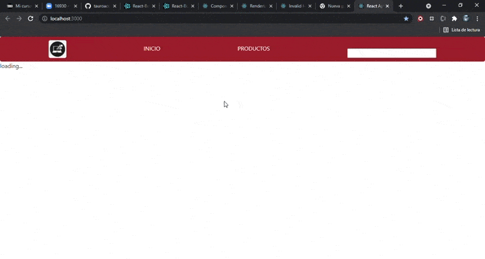

# Getting Started with Create React App

This project was bootstrapped with [Create React App](https://github.com/facebook/create-react-app).

## Available Scripts

In the project directory, you can run:

### `yarn start`

Runs the app in the development mode.\
Open [http://localhost:3000](http://localhost:3000) to view it in the browser.

The page will reload if you make edits.\
You will also see any lint errors in the console.

### Proyecto Ecommerce "Arma Tu PC"

## Drescripcion:
Arma tu pc es un proyecto generado en base a React con la finalidad de generar una pagina web ecommer con la funcionalidad de generar una orden de compra, el cual la pagina trata de venta de partes de computadora como las Motherboards y Tarjetas de video manipulando una base de datos actualizable en stocks.

### Herramientas Integradas al Proyecto
-React (interfaz)
-Javascript(lenguaje de programacion)
-Css (etiquetas de estilo)
-BEM (metodología ágil)
-Firebase (base de datos)
-React-Boostarp (biblioteca de estilos)
-React-icons(biblioteca de iconos)

### Demostracion de Funcionalidad de Pagina

## Desarrollador
Gianfranco Morais Reyna